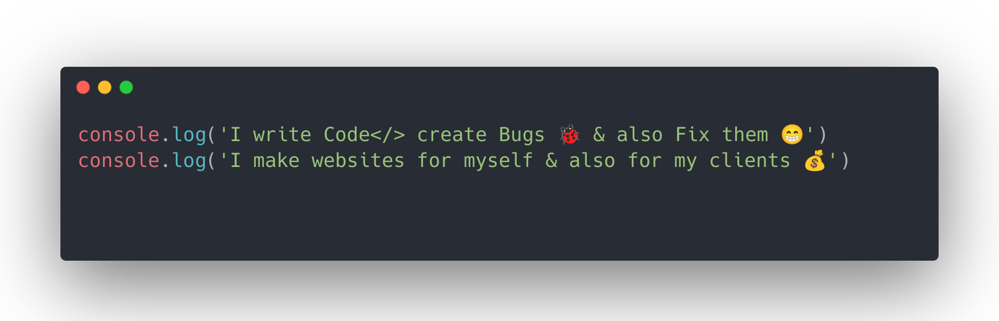

# Hi, Devs it's Priyankar

## 

**Hello, developers, I'm Priyankar Pal from India 🇮🇳 I've 2 years+ of knowledge on web development field. Now I'm a 1st year Computer Science Engineering Student. Previously I worked as a freelance web developer for my local client**

<h3 align="center"> Web Developer | Tech Blogger </h3>

- 🌍  I'm based in India
- 🖥️  See my portfolio at [here](http://priyankarpal.netlify.app)
- ✉️  You can contact me at [priyankarpal9@gmail.com](mailto:priyankarpal9@gmail.com)
- 🚀  I'm currently working on [Dark VS Code Theme](http://github.com/priyankarpal/DarkThemeVsCode)
- 🧠  I'm learning cool Technology
- 🤝  I'm open to collaborating on cool open source projects
- ⚡  I know I'm lazy

### Technical Skills 🛠

### Socials

     

### Badges

<b>My GitHub Stats</b>

